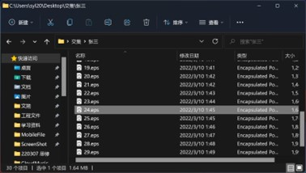

# 实验 1 - turtle 绘图

> 智能 212 史胤隆 2006010529  
> 指导老师：刘迎

## 实验内容

turtle 绘图作业：你最得意的至少一个作品提交实验报告，实验报告按标准模板来。


## 作品一 交集

> 本作品版权已应用，故此处仅做作业展示，不做其他用途。

### 作品信息

作品名：交集

### 作品内容

我们如果将与身边每位亲友的关系比作为一棵棵大树，那么只有你来我往、相互交流，并随着时间的流逝不曾变异，这棵树方能成长得自然。在这个作品中，我们将每一组个人关系比作一棵树，由下至上代表着时间的成长，左右两侧分别代表相互的往来。现在，试着输入代表你们关系的值（例如微信聊天条数），看看会发生什么。

作品包括了对递归的应用。

作品包括了对随机的应用。

### 作品特点:

1. 提供色彩自定义功能，可以在代码开头的常量中调整各部分颜色
1. 代码鲁棒性完备，交互提示完全，具有抵抗意外输入的能力
1. 支持导出完整的矢量图片，并能够建立文件夹结构
1. 在选择路径等操作复杂处制作了简易的 GUI 界面
1. 提示文字诗歌化，提高艺术表达性

### 代码

```python
import os
import math
import shutil
import tkinter
import tkinter.filedialog
import tkinter.messagebox
import turtle as t
import random as r

Project = {"Name": "交集", "Path": ".\\", "Leaves": 0, "IsLeft": True, "Max": 0}
COLOR = {
    "边框": "black",
    "树干": "peru",
    "树枝": "peru",
    "树叶": ["green", "lightgreen", "darkgreen"],
    "背景": "lightblue",
}  # 背景色不会被保存
onename_list = []


def path():
    tkinter.Tk().withdraw()
    if tkinter.messagebox.askokcancel("交  集", "将在桌面建立文件夹"):
        path_path = os.path.expanduser("~/Desktop/{}".format(Project["Name"]))
    else:
        p = tkinter.filedialog.askdirectory()
        if p == "":
            exit()
        path_path = os.path.join(p, Project["Name"])
    Project["Path"] = os.path.abspath(path_path)
    if not os.path.exists(Project["Path"]):
        os.makedirs(Project["Path"])


def setting():
    t.setup(450, 675)
    t.screensize(400, 600)
    t.bgcolor(COLOR["背景"])


def ready():
    t.resetscreen()
    t.ht()
    t.speed(0)
    t.left(90)
    t.up()
    t.goto(0, -300)
    t.down()
    t.pensize(1)
    t.pencolor(COLOR["边框"])
    t.goto(-200, -300)
    t.goto(-200, 300)
    t.goto(200, 300)
    t.goto(200, -300)
    t.goto(0, -300)
    t.pencolor(COLOR["树干"])
    for i in range(1, 30):
        t.pensize(30 - i)
        t.fd(i)


def tree(n, l):
    if Project["Leaves"] >= Project["Max"]:
        return
    t.pd()
    t.pencolor(COLOR["树枝"])
    t.pensize(n / 4)
    x, y = t.pos()
    t.forward(l)
    if n > 0:
        b = r.random() * 15 + 10
        c = r.random() * 15 + 10
        d = l * (r.random() * 0.35 + 0.6)
        if Project["IsLeft"]:
            t.right(b)
            tree(n - 1, d)
            t.left(b + c)
            tree(n - 1, d)
            t.right(c)
        else:
            t.left(b)
            tree(n - 1, d)
            t.right(b + c)
            tree(n - 1, d)
            t.left(c)
    else:
        t.right(90)
        t.pencolor(r.choice(COLOR["树叶"]))
        t.circle(2)
        t.left(90)
        Project["Leaves"] = Project["Leaves"] + 1
    t.pu()
    t.goto(x, y)


def draw(count, onenumber):
    Project["Max"] = int(math.sqrt(count))
    Project["Leaves"] = 0
    for n in range(1, 13):
        if 2 ** (n - 1) >= Project["Max"]:
            break
    l = 100 * 0.8 ** (13 - n)
    tree(n, l)


def trees(onename, onenumber):
    if onename not in onename_list:
        onename_list.append(onename)
        onepath = os.path.join(Project["Path"], onename)
        if os.path.exists(onepath):
            shutil.rmtree(onepath)
        os.makedirs(onepath)
        step = 390 / onenumber
        now = -255
        ready()
        for i in range(1, onenumber + 1):
            print()
            left = input("在故事的第{}段，你对Ta说了多少话：".format(i))
            while not left.isdigit():
                left = input("请输入整数：")
            left = eval(left)
            right = input("在故事的第{}段，你对Ta说了多少话：".format(i))
            while not right.isdigit():
                right = input("请输入整数：")
            right = eval(right)
            print("请等待完成绘制... ")
            t.up()
            t.goto(0, now)
            nowSeth = 35 * (onenumber - i) / onenumber + 10
            t.seth(90 + nowSeth)
            Project["IsLeft"] = True
            draw(left, onenumber)
            t.seth(90 - nowSeth)
            Project["IsLeft"] = False
            draw(right, onenumber)
            now = now + step
            ts = t.getscreen()
            ts.getcanvas().postscript(
                file=os.path.join(onepath, "{:0>2}.eps".format(i))
            )
            print("绘制完成...")
        print("\n至此，Ta的故事告一段落，未完且待续。")
    else:
        print("\n你已讲过有关Ta的一章。")
    print("还有吗？你可以告诉我下一个人的名字了。")
    print("如果没有更多，请只按下Enter... ")


def end():
    print("\n讲述完毕，你的故事已经凝为诗篇。")
    t.bye()
    print("按下 Enter 吧，结束你的旅途，将为你打开刻满记忆的画卷。")
    print("\nPress Enter to Exit... ")
    input()
    os.system("start explorer " + Project["Path"])
    exit()


print(
    """
***********************************************************

                    --  交  集  --
                当暖流相迎，风总会向上盘旋

***********************************************************
                              Software by Vincy 2021 - 2024
"""
)
path()
print(
    '''
            *
           /.\\               如果有这么一天：
          /..'\\              烈日的光芒只来自一个方向
          /'.'\\              少年的歌谣不再有诗和远方
         /.''.'\\             微风还能徜徉
         /.'.'.\\             树木仍会生长
  "'""""/'.''.'.\\""'"'"      只是会长成人们不愿看到的模样。
        ^^^[_]^^^
'''
)
print("就此回忆吧，在风沙掩埋记忆之前，就此开始抒写你和Ta们的故事。")
print("\n故事不长，但也足够分得篇章。每一个人的故事，你又想分成几段讲？")
onenumber = input("告诉我吧，请输入整数：")
while not (onenumber.isdigit() and eval(onenumber) in range(2, 31)):
    onenumber = input("\n太多赘述亦难以成章。\n请输入 2 ~ 30：")
onenumber = eval(onenumber)
onename = input("\n好的。记忆里的第一个人，Ta叫什么：")
setting()
while onename != "":
    trees(onename, onenumber)
    onename = input("\n来吧，请输入：")
end()

```


### 作品展示

- 控制台页面

  

  

- GUI 页面

  

  <div STYLE="page-break-after: always;"></div>

- 文件页面

  

  

- Turtle 页面

  

  

-   成品

    

<div STYLE="page-break-after: always;"></div>

## 作品二 日出海上

### 作品信息

作品名：日出海上

### 作品内容：

海上的一轮明日冉冉升起。波涛，红日，以及恰到好处的留白，构成了如此一幅『浮世绘』风格的作品。

至于升起多少？这将会与现实的你产生共鸣而决定。

### 作品特点:

1. 提供色彩自定义功能，可以在代码开头的常量中调整各部分颜色
1. 代码鲁棒性完备，对于较复杂的部分提供了自定义的错误抛出
1. 太阳升起的最高高度有当前电池电量决定（仅支持 Windows 系统）
1. 第三方库不存在时不会报错，将引导用户安装第三方库
1. 制作了太阳从海平面直到升起到指定位置的动画

> 注：
>
> 1. 对 macOS 支持性未知，macOS 请使用 python123 上传版本。
> 2. 动画效果预览见 https://a.vincent1230.top/220315_日出海上.gif

### 代码

```python
SKY_COLOR_START = (0, 49, 90)
SKY_COLOR_END = (0, 146, 246)
SUN_COLOR = (161, 35, 24)
SEA_COLOR_DARK_START = (4, 50, 135)
SEA_COLOR_DARK_END = (13, 27, 161)
SEA_COLOR_LIGHT_START = (127, 127, 127)
SEA_COLOR_LIGHT_END = (255, 255, 255)


import os
import turtle as t

try:
    import psutil
except ImportError:
    if str.upper(input('缺少必要的第三方库 (\033[35mpsutil\033[0m), 是否开始下载 (Y/N): ')) == 'Y':
        os.system('pip install -i https://pypi.tuna.tsinghua.edu.cn/simple psutil')
        try:
            import psutil
        except ImportError:
            print('安装出现问题, 请重新尝试。')
            exit()
    else:
        exit()


# 获取电池笔记本电池的参数，一般是percent=70, secsleft=9465, power_plugged=False
battery = psutil.sensors_battery()
percent = battery.percent  # 查看电池剩余量

# 一维渐变起，一维渐变止，一维渐变刻度，二维渐变量，二维渐变目标
def setcolor(start, end, step=0.5, qu=1, qucolor='black'):
    if len(start) != 3 or len(end) != 3 or step < 0 or step > 1 or type(qu) != type(1) or qu < 1:
        raise Exception('setcolor 函数传入值错误')
    for i in start+end:
        if i < 0 or i > 255 or type(i) != type(1):
            raise Exception('setcolor 函数传入值错误')
    newcolor = []
    for i in range(3):
        newcolor.append(int((1.0 - step) * start[i] + step * end[i]))
    newcolor = tuple(newcolor)
    if qu == 1:
        return newcolor
    op = []
    if qucolor == 'black':
        qucolor = (0, 0, 0)
    elif qucolor == 'white':
        qucolor = (255, 255, 255)
    else:
        raise Exception('qucolor 仅限传入 black 或 white')
    for i in range(qu, 0, -1):
        onecolor = []
        for j in range(3):
            onecolor.append(
                int(i / qu * newcolor[j] + (1.0 - i / qu) * qucolor[j]))
        op.append(tuple(onecolor))
    return op

# 列表：100组渐变色
def sky(colors):
    t.up()
    t.seth(0)
    t.pensize(3)
    t.goto(-200, 149)
    t.down()
    for i in range(100):
        t.pencolor(colors[i])
        t.fd(400)
        t.up()
        t.goto(-200, 149-3*i)
        t.down()

# 圆心，半径
def sun(center=(0, 0), r=50):
    t.up()
    t.seth(0)
    t.goto(center[0], center[1]-r)
    t.pensize(1)
    t.pencolor(SUN_COLOR)
    t.fillcolor(SUN_COLOR)
    t.down()
    t.begin_fill()
    t.circle(r)
    t.end_fill()

# 圆心，半径，色彩一，色彩二，层数
def sea(center, r, darkcolor, lightcolor, plies=9):
    psize = r / plies
    t.pensize(psize)
    r = (psize/2)
    for i in range(plies):
        t.up()
        t.seth(90)
        t.goto(center[0]+r, center[1])
        if i % 2 == 0:
            t.pencolor(darkcolor)
        else:
            t.pencolor(lightcolor)
        t.down()
        t.circle(r, 180)
        r = r + psize


t.speed(0)
t.delay(0)
t.hideturtle()
t.colormode(255)
t.tracer(False)

for i in range(percent):
    t.clear()
    # 绘制画面
    sky(setcolor(SKY_COLOR_START, SKY_COLOR_END, step=i/100, qu=100, qucolor='white'))
    sun(center=(0, i-100))
    darkcolor = setcolor(SEA_COLOR_DARK_START, SEA_COLOR_DARK_END, step=i/100)
    lightcolor = setcolor(SEA_COLOR_LIGHT_START, SEA_COLOR_LIGHT_END, step=i/100)
    for y in range(-65, -166, -25):
        for x in range(-200, 201, 50):
            sea((x, y), 25, darkcolor, lightcolor, 9)
for x in range(-175, 176, 50):
sea((x, y-12.5), 25, darkcolor, lightcolor, 9)
# 绘制画框
t.up()
t.goto(-250, 200)
t.pensize(100)
t.pencolor(255, 255, 255)
t.seth(0)
t.down()
for j in range(2):
t.fd(500)
t.right(90)
t.fd(400)
t.right(90)
# 刷新帧
t.update()
print('绘制完毕')
t.done()

```


### 作品展示


