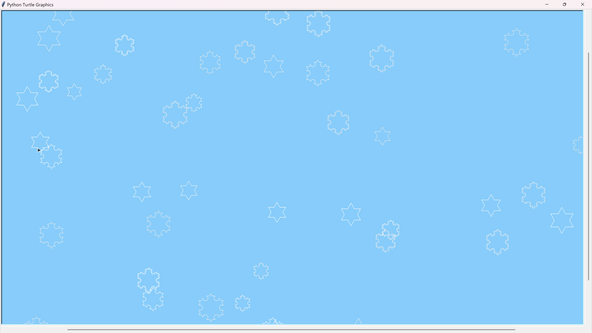
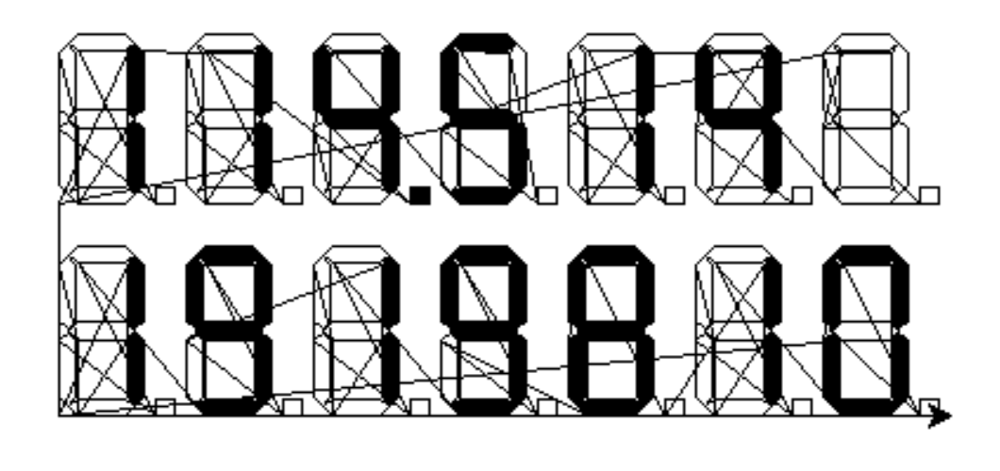
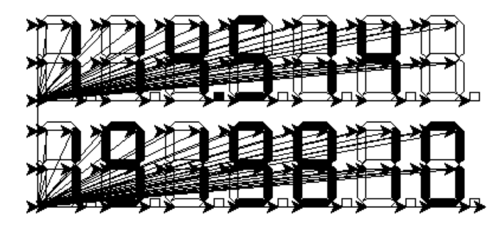
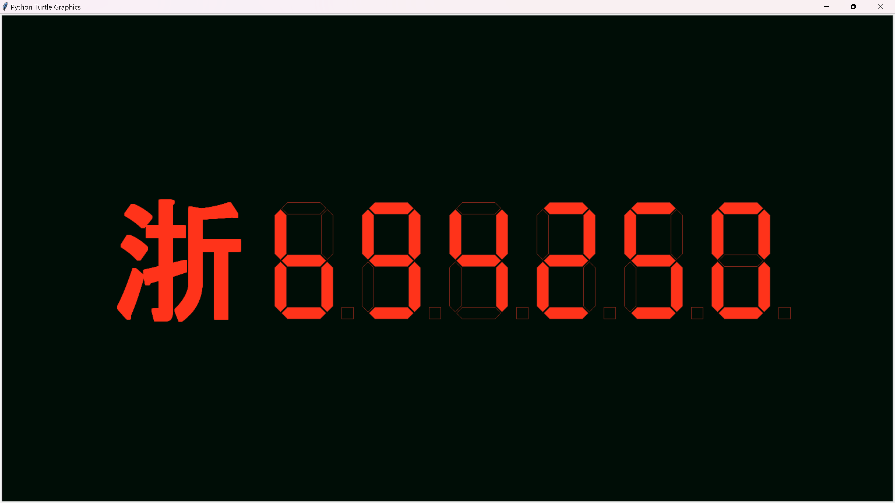
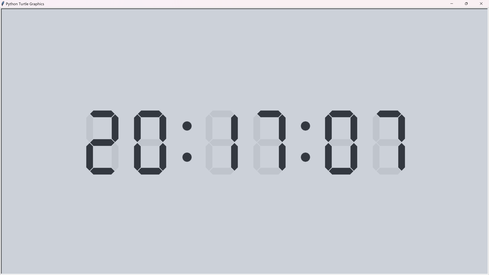

# 实验 2 - 七段数码管 + 创意雪花或分形

> 智能 212 史胤隆 2006010529  
> 指导老师：刘迎


## 实验内容

turtle 绘图作业：完成你自己特色的七段数码管绘制和创意雪花绘制


## 创意雪花

#### 完整代码

```python
import turtle as t
import random as rd

t.delay(0)
t.speed(0)
t.bgcolor(0.53, 0.8, 0.98)

def snowflake(size, n):
    def _koch(size, n):
        if n == 0:
            t.fd(size)
        else:
            for angle in [0, 60, -120, 60]:
                t.left(angle)
                _koch(size / 3, n - 1)
    for _ in range(3):
        _koch(size, n)
        t.right(120)

screensize = t.screensize()
snow_amount = int((screensize[0] + screensize[1]) // 50 * (rd.random() + 0.5))
for _ in range(snow_amount):
    t.penup()
    t.goto(
        rd.randint(-screensize[0] // 2, screensize[0] // 2),
        rd.randint(-screensize[1] // 2, screensize[1] // 2),
    )
    t.pendown()
    t.pencolor(*(rd.random() / 10 + 0.9,) * 3)
    snowflake(rd.randint(min(screensize), max(screensize)) / 30, rd.randint(1, 3))
t.done()

```

<div STYLE="page-break-after: always;"></div>

#### 实验效果




## 七段数码管

这部分我仿照 `turtle.write()` 建立了一个性能良好、功能齐全的数码管显示功能库，并提供同步、异步、异步阻塞三种调用方式。

> digital_tube 模块完整源码见附录或 [GitHub - Vincy1230](https://github.com/Vincy1230/Python-ALG/tree/main/exp02/digital_tube)

| 同步绘制            | 异步绘制            |
| ------------------- | ------------------- |
|  |  |


```python
<(module) digital_tube>
"""
七 (八) 段数码管显示模块

        author: (c) 2024 Vincy SHI | 史云昔
        date: 2024-06-16

    本模块使用 Python 标准库 turtle 实现了七 (八) 段数码管绘制模块，支持任意16进制数字小数点显示，支持异步显示。

    模块对外提供了三个函数:
        digital_tube: 直接操作默认 turtle 画笔绘制，同时也用于传入非默认 turtle 画笔绘制.
        digital_tube_async: 异步绘制，支持传入非默认 turtle 画笔和直接操作 turtle 画笔. 不会阻塞, 需要 python async 协程事件循环.
        digital_tube_await: 异步绘制的同步阻塞版本，同时也用于传入非默认 turtle 画笔绘制.

    支持的字符集:
        0-9, A-F, a-f, 空格 (可表示为空格符或下划线), 小数点 (可表示为小数点或字母 p/P), 换行符 (\\n).
    支持的对齐方式:
        "left", "center", "right".
    支持的字体风格:
        标准 (normal), 斜体 (italic). 所有的字体风格都是等宽字体, 且高度和宽度比例为 1:0.75
    支持的刷新级别 (仅在已设置 tracer 时有效):
        全部绘制完成后刷新 (digital), 每行刷新 (line), 每个字符刷新 (char), 字符的每一笔绘制完后刷新 (path), 不自动刷新 (None).

    其余属性 (描边颜色, 填充颜色, 线宽, 起笔位置等) 继承自画笔本身, 请直接操作 turtle 画笔进行设置.
    函数的详细参数和返回值请参考函数文档字符串.
"""

```


```python
def digital_tube(
    digitals: str, move: bool = False, align: _Align = "left", font: _Font = (72, "normal"),
    frame: bool = False, line_height: float = 1.25, refresh_level: _RLevel = None, pen: t.Turtle = t.getturtle()
) -> None:
    """
    直接操作默认 turtle 画笔绘制，同时也用于传入非默认 turtle 画笔绘制.
    :param digitals: 要绘制为数码管的数字字符串, 支持大小写16进制数字(0-9/a-f/A-F), 小数点(./p/P), 空格( /_)和换行符(\\n).
    :param move: 绘制完成后画笔(是/否)移动到最后一个字符的位置. 如果 move 为真值, 画笔会移至文本的右下角. 默认情况下 move 为 False.
    :param align: 字符串 "left", "center" 或 "right". 将文本指定对齐并绘制在当前画笔位置.
    :param font: 一个二元组 (font_size, font_style). font_size 支持以整数表示的字高, font_style 支持 "normal" 和 "italic".
    :param frame: (是/否)绘制数码管不亮的部分.
    :param line_height: 存在多行时, 设置行高.
    :param refresh_level: 刷新级别, "path", "char", "line", "digital", None, 仅在已设置 tracer() 时有效.
    :param pen: 传入 turtle.Turtle 对象. 默认采用当前画布默认的 turtle 画笔.
    :return: None
    """

def digital_tube_await(
    digitals: str, move: bool = False, align: _Align = "left", font: _Font = (72, "normal"),
    frame: bool = False, line_height: float = 1.25, refresh_level: _RLevel = None, pen: t.Turtle = t.getturtle()
) -> None:
    """ 异步绘制数码管的同步阻塞版本，同时也用于传入非默认 turtle 画笔绘制. """


def digital_tube_async(
    digitals: str, move: bool = False, align: _Align = "left", font: _Font = (72, "normal"),
    frame: bool = False, line_height: float = 1.25, refresh_level: _RLevel = None, pen: t.Turtle = t.getturtle()
) -> None:
    """ 异步绘制，支持传入非默认 turtle 画笔和直接操作 turtle 画笔. 本函数不会阻塞, 直接调用本函数需要自行设置 python async 协程事件循环. """

```

通过这个库，我们可以很方便地绘制出各种数字、字母、符号的七段数码管显示效果。


### 使用数码管与 `write()` 结合绘制车牌号

#### 完整代码

```python
import turtle as t
from digital_tube import digital_tube

# 浙 B94250
t.delay(0)
t.speed(0)
t.bgcolor(0, 0.05, 0.025)
t.hideturtle()
t.penup()
t.goto(-300, -100)
t.pencolor(0.5, 0.15, 0.1)
t.fillcolor(1.0, 0.2, 0.1)
digital_tube("b94250", font=(200, "normal"), frame=True)
t.goto(-580, -135)
t.color(1.0, 0.2, 0.1)
t.write("浙", font=("Arial", 175, "bold"))
t.done()

```

#### 实验效果



<div STYLE="page-break-after: always;"></div>

### 数码管电子时钟

由于良好的性能，我们甚至可以做到秒级响应、实时更新的电子时钟。

#### 完整代码

```python
import turtle as t
from digital_tube import digital_tube
from datetime import datetime
import time

DELAY_TIME = 0.8
TUBES_POS = [
    (-500, -100), (-350, -100),
    (-125, -100), (25, -100),
    (250, -100), (400, -100)
]
COL_POS = [(-180, -100), (192, -100)]

def re_draw(char: str, pen: t.Turtle):
    pen.clear()
    digital_tube(char, font=(200, "normal"), pen=pen)
    time.sleep(0.05)

t.Screen().tracer(0)
t.Screen().delay(0)
t.Screen().bgcolor(0.8, 0.82, 0.85)
t.speed(0)
t.pensize(1)
t.hideturtle()
t.color(0.2, 0.22, 0.25)
t.penup()

for pos in COL_POS:
    t.goto(pos)
    t.clone().write(":", align="center", font=("Yahei", 200, "normal"))

tubes = [t.clone() for _ in range(6)]
for i, pos in enumerate(TUBES_POS):
    tubes[i].goto(pos)
    bg = tubes[i].clone()
    bg.color(0.75, 0.77, 0.8)
    digital_tube("8", font=(200, "normal"), pen=bg)
past_time = "xxxxxx"

try:
    while True:
        now_time = datetime.now().strftime("%H%M%S")
        for i in range(6):
            if now_time[i] != past_time[i]:
                re_draw(now_time[i], tubes[i])
                changed = True
        past_time = now_time
        t.update()
        if changed:
            time.sleep(DELAY_TIME)
        changed = False

except t.Terminator:
    print("Already terminated.")

```


#### 实验效果




## 附录: `digital_tube` 模块完整源码

#### ***\_\_init\_\_.py***

```python
from .draw import *
from .draw_async import *

__doc__ = """
七 (八) 段数码管显示模块

        author: (c) 2024 Vincy SHI | 史云昔
        date: 2024-06-16

    本模块使用 Python 标准库 turtle 实现了七 (八) 段数码管绘制模块，支持任意16进制数字小数点显示，支持异步显示。

    模块对外提供了三个函数: 
        digital_tube: 直接操作默认 turtle 画笔绘制，同时也用于传入非默认 turtle 画笔绘制.
        digital_tube_async: 异步绘制，支持传入非默认 turtle 画笔和直接操作 turtle 画笔. 不会阻塞, 需要 python async 协程事件循环.
        digital_tube_await: 异步绘制的同步阻塞版本，同时也用于传入非默认 turtle 画笔绘制.

    支持的字符集: 
        0-9, A-F, a-f, 空格 (可表示为空格符或下划线), 小数点 (可表示为小数点或字母 p/P), 换行符 (\\n).
    支持的对齐方式: 
        "left", "center", "right".
    支持的字体风格: 
        标准 (normal), 斜体 (italic). 所有的字体风格都是等宽字体, 且高度和宽度比例为 1:0.75
    支持的刷新级别 (仅在已设置 tracer 时有效): 
        全部绘制完成后刷新 (digital), 每行刷新 (line), 每个字符刷新 (char), 字符的每一笔绘制完后刷新 (path), 不自动刷新 (None).

    其余属性 (描边颜色, 填充颜色, 线宽, 起笔位置等) 继承自画笔本身, 请直接操作 turtle 画笔进行设置.
    函数的详细参数和返回值请参考函数文档字符串. 
"""

__all__ = ["digital_tube", "digital_tube_await", "digital_tube_async"]

```

#### ***draw.py***

```python
from ._digital_tube import *
import turtle as t

__all__ = [
    "digital_tube",
    "_digital_tube_line",
    "_digital_tube_char",
    "_digital_tube_path",
]


def digital_tube(
    digitals: str,
    move: bool = False,
    align: _Align = "left",
    font: _Font = (72, "normal"),
    frame: bool = False,
    line_height: float = 1.25,
    refresh_level: _RLevel = None,
    pen: t.Turtle = t.getturtle(),
) -> None:
    """
    直接操作默认 turtle 画笔绘制，同时也用于传入非默认 turtle 画笔绘制.
    :param digitals: 要绘制为数码管的数字字符串, 支持大小写16进制数字(0-9/a-f/A-F), 小数点(./p/P), 空格( /_)和换行符(\\n).
    :param move: 绘制完成后画笔(是/否)移动到最后一个字符的位置. 如果 move 为真值, 画笔会移至文本的右下角. 默认情况下 move 为 False.
    :param align: 字符串 "left", "center" 或 "right". 将文本指定对齐并绘制在当前画笔位置.
    :param font: 一个二元组 (font_size, font_style). font_size 支持以整数表示的字高, font_style 支持 "normal" 和 "italic".
    :param frame: (是/否)绘制数码管不亮的部分.
    :param line_height: 存在多行时, 设置行高.
    :param refresh_level: 刷新级别, "path", "char", "line", "digital", None, 仅在已设置 tracer() 时有效.
    :param pen: 传入 turtle.Turtle 对象. 默认采用当前画布默认的 turtle 画笔.
    :return: None
    """
    args_check(digitals, align, font[1], refresh_level)
    _align_dict = {"left": "<", "center": "^", "right": ">"}
    lines = digitals.split("\n")
    max_len = max(len_line(line) for line in lines)
    lines = [
        f"{line:{_align_dict[align]}{len(line)+max_len-len_line(line)}}"
        for line in lines
    ]
    ipen_isdown, ipen_isvisible = pen.isdown(), pen.isvisible()
    pen.penup()
    pen.hideturtle()
    pos_list = [
        pen.pos() + t.Vec2D(0, (len(lines) - i - 1) * line_height * font[0])
        for i in range(len(lines))
    ]
    for pos, line in zip(pos_list[:-1], lines[:-1]):
        pen.goto(pos)
        _digital_tube_line(
            line,
            move=False,
            align=align,
            font=font,
            frame=frame,
            refresh_level=refresh_level,
            pen=pen,
        )
    pen.goto(pos_list[-1])
    if ipen_isdown:
        pen.pendown()
    if ipen_isvisible:
        pen.showturtle()
    _digital_tube_line(
        lines[-1],
        move=move,
        align=align,
        font=font,
        frame=frame,
        refresh_level=refresh_level,
        pen=pen,
    )
    if refresh_level == "digital":
        t.update()


def _digital_tube_line(
    line: str,
    move: bool = False,
    align: _Align = "left",
    font: _Font = (72, "normal"),
    frame: bool = False,
    refresh_level: _RLevel = None,
    pen: t.Turtle = t.getturtle(),
) -> None:
    """绘制一行数码管字符."""
    line = line.lower().replace(" ", "_")
    font_size, _ = font
    ipen_isdown, ipen_pos, ipen_isvisible = pen.isdown(), pen.pos(), pen.isvisible()
    pos_list = words_pos(ipen_pos, line, align, font_size)
    line += "x"
    pen.hideturtle()
    i = 0
    for char in range(1, len(line)):
        if line[char] in CTRL_CH:
            _digital_tube_char(
                line[char - 1],
                font,
                pos_list[i],
                pt=True,
                frame=frame,
                refresh_level=refresh_level,
                pen=pen,
            )
        elif line[char - 1] in CTRL_CH:
            continue
        else:
            _digital_tube_char(
                line[char - 1],
                font,
                pos_list[i],
                pt=False,
                frame=frame,
                refresh_level=refresh_level,
                pen=pen,
            )
        i += 1
    pen.penup()
    pen.goto(ipen_pos)
    if ipen_isdown:
        pen.pendown()
    if ipen_isvisible:
        pen.showturtle()
    if move:
        pen.goto(pos_list[-1])
    if refresh_level == "line":
        t.update()


def _digital_tube_char(
    char: str,
    font: _Font,
    pos: t.Vec2D,
    pt: bool = False,
    frame: bool = False,
    refresh_level: _RLevel = None,
    pen: t.Turtle = t.getturtle(),
) -> None:
    """绘制一个数码管字符."""
    font_size, font_style = font
    mapper = Mapper(pos, font_size)
    paths = CHAR_SET[char] | {"p"} if pt else CHAR_SET[char]
    for path in paths:
        _digital_tube_path(
            mapper,
            NODES_SET[font_style][path],
            fill=True,
            refresh_level=refresh_level,
            pen=pen,
        )
    if frame:
        for path in PATH_NAME_SPACE - paths:
            _digital_tube_path(
                mapper,
                NODES_SET[font_style][path],
                fill=False,
                refresh_level=refresh_level,
                pen=pen,
            )
    if refresh_level == "char":
        t.update()


def _digital_tube_path(
    mapper: Mapper,
    path: _Path,
    fill: bool = True,
    refresh_level: _RLevel = None,
    pen: t.Turtle = t.getturtle(),
) -> None:
    """绘制数码管字符的一条."""
    pen.penup()
    pen.goto(mapper(path[-1]))
    pen.pendown()
    if fill:
        pen.begin_fill()
    for j in path:
        pen.goto(mapper(j))
    if fill:
        pen.end_fill()
    if refresh_level == "path":
        t.update()


if __name__ == "__main__":
    t.fd(-200)
    t.speed(0)
    t.tracer(0)
    digital_tube("114.514\n1919810", move=True, frame=True, pen=t.clone())
    t.update()
    t.done()

```

#### ***draw\_async.py***

```python
from ._digital_tube import *
from asyncio import run, gather, create_task
import turtle as t

__all__ = [
    "digital_tube_await",
    "digital_tube_async",
    "_digital_tube_line_async",
    "_digital_tube_char_async",
    "_digital_tube_path_async",
]


def digital_tube_await(
    digitals: str,
    move: bool = False,
    align: _Align = "left",
    font: _Font = (72, "normal"),
    frame: bool = False,
    line_height: float = 1.25,
    refresh_level: _RLevel = None,
    pen: t.Turtle = t.getturtle(),
) -> None:
    """
    异步绘制数码管的同步阻塞版本，同时也用于传入非默认 turtle 画笔绘制.
    :param digitals: 要绘制为数码管的数字字符串, 支持大小写16进制数字(0-9/a-f/A-F), 小数点(./p/P), 空格( /_)和换行符(\\n).
    :param move: 绘制完成后画笔(是/否)移动到最后一个字符的位置. 如果 move 为真值, 画笔会移至文本的右下角. 默认情况下 move 为 False.
    :param align: 字符串 "left", "center" 或 "right". 将文本指定对齐并绘制在当前画笔位置.
    :param font: 一个二元组 (font_size, font_style). font_size 支持以整数表示的字高, font_style 支持 "normal" 和 "italic".
    :param frame: (是/否)绘制数码管不亮的部分.
    :param line_height: 存在多行时, 设置行高.
    :param refresh_level: 刷新级别, "path", "char", "line", "digital", None, 仅在已设置 tracer() 时有效.
    :param pen: 传入 turtle.Turtle 对象. 默认采用当前画布默认的 turtle 画笔.
    :return: None
    """
    args_check(digitals, align, font[1], refresh_level)
    run(
        digital_tube_async(
            digitals=digitals,
            move=move,
            align=align,
            font=font,
            frame=frame,
            line_height=line_height,
            refresh_level=refresh_level,
            pen=pen,
        )
    )


async def digital_tube_async(
    digitals: str,
    move: bool = False,
    align: _Align = "left",
    font: _Font = (72, "normal"),
    frame: bool = False,
    line_height: float = 1.25,
    refresh_level: _RLevel = None,
    pen: t.Turtle = t.getturtle(),
) -> None:
    """
    异步绘制，支持传入非默认 turtle 画笔和直接操作 turtle 画笔. 本函数不会阻塞, 直接调用本函数需要自行设置 python async 协程事件循环.
    :param digitals: 要绘制为数码管的数字字符串, 支持大小写16进制数字(0-9/a-f/A-F), 小数点(./p/P), 空格( /_)和换行符(\\n).
    :param move: 画笔(是/否)移动到最后一个字符的位置, 不需要等待绘制完成. 如果 move 为真值, 画笔会移至文本的右下角.
    :param align: 字符串 "left", "center" 或 "right". 将文本指定对齐并绘制在当前画笔位置.
    :param font: 一个二元组 (font_size, font_style). font_size 支持以整数表示的字高, font_style 支持 "normal" 和 "italic".
    :param frame: (是/否)绘制数码管不亮的部分.
    :param line_height: 存在多行时, 设置行高.
    :param refresh_level: 刷新级别, "path", "char", "line", "digital", None, 仅在已设置 tracer() 时有效.
    :param pen: 传入 turtle.Turtle 对象. 默认采用当前画布默认的 turtle 画笔.
    :return: None
    """
    _align_dict = {"left": "<", "center": "^", "right": ">"}
    lines = digitals.split("\n")
    max_len = max(len_line(line) for line in lines)
    lines = [
        f"{line:{_align_dict[align]}{len(line)+max_len-len_line(line)}}"
        for line in lines
    ]
    ipen_isdown, ipen_isvisible = pen.isdown(), pen.isvisible()
    pen.penup()
    pen.hideturtle()
    pos_list = [
        pen.pos() + t.Vec2D(0, (len(lines) - i - 1) * line_height * font[0])
        for i in range(len(lines))
    ]
    futures = []
    for pos, line in list(zip(pos_list[:-1], lines[:-1])):
        pen.goto(pos)
        futures.append(
            _digital_tube_line_async(
                line,
                move=False,
                align=align,
                font=font,
                frame=frame,
                refresh_level=refresh_level,
                pen=pen.clone(),
            )
        )
    pen.goto(pos_list[-1])
    if ipen_isdown:
        pen.pendown()
    if ipen_isvisible:
        pen.showturtle()
    futures.append(
        _digital_tube_line_async(
            lines[-1],
            move=move,
            align=align,
            font=font,
            frame=frame,
            refresh_level=refresh_level,
            pen=pen,
        )
    )
    await gather(*futures)
    if refresh_level == "digital":
        t.update()


async def _digital_tube_line_async(
    line: str,
    move: bool = False,
    align: _Align = "left",
    font: _Font = (72, "normal"),
    frame: bool = False,
    refresh_level: _RLevel = None,
    pen: t.Turtle = t.getturtle(),
) -> None:
    """绘制一行数码管字符. 异步, 支持传入画笔."""
    line = line.lower().replace(" ", "_")
    font_size, _ = font
    ipen_isdown, ipen_pos, ipen_isvisible = pen.isdown(), pen.pos(), pen.isvisible()
    pos_list = words_pos(ipen_pos, line, align, font_size)
    line += "x"
    pen.hideturtle()
    i = 0
    futures = []
    for char in range(1, len(line)):
        if line[char] in CTRL_CH:
            futures.append(
                _digital_tube_char_async(
                    line[char - 1],
                    font,
                    pos_list[i],
                    pt=True,
                    frame=frame,
                    refresh_level=refresh_level,
                    pen=pen.clone(),
                )
            )
        elif line[char - 1] in CTRL_CH:
            continue
        else:
            futures.append(
                _digital_tube_char_async(
                    line[char - 1],
                    font,
                    pos_list[i],
                    pt=False,
                    frame=frame,
                    refresh_level=refresh_level,
                    pen=pen.clone(),
                )
            )
        i += 1
    pen.penup()
    pen.goto(ipen_pos)
    if ipen_isdown:
        pen.pendown()
    if ipen_isvisible:
        pen.showturtle()
    if move:
        pen.goto(pos_list[-1])
    await gather(*futures)
    if refresh_level == "line":
        t.update()


async def _digital_tube_char_async(
    char: str,
    font: _Font,
    pos: t.Vec2D,
    pt: bool = False,
    frame: bool = False,
    refresh_level: _RLevel = None,
    pen: t.Turtle = t.getturtle(),
) -> None:
    """绘制一个数码管字符. 异步, 支持传入画笔."""
    font_size, font_style = font
    mapper = Mapper(pos, font_size)
    paths = CHAR_SET[char] | {"p"} if pt else CHAR_SET[char]
    futures = []
    for path in paths:
        futures.append(
            _digital_tube_path_async(
                mapper,
                NODES_SET[font_style][path],
                fill=True,
                refresh_level=refresh_level,
                pen=pen.clone(),
            )
        )
    if frame:
        for path in PATH_NAME_SPACE - paths:
            futures.append(
                _digital_tube_path_async(
                    mapper,
                    NODES_SET[font_style][path],
                    fill=False,
                    refresh_level=refresh_level,
                    pen=pen.clone(),
                )
            )
    await gather(*futures)
    if refresh_level == "char":
        t.update()


async def _digital_tube_path_async(
    mapper: Mapper,
    path: _Path,
    fill: bool = True,
    refresh_level: _RLevel = None,
    pen: t.Turtle = t.getturtle(),
) -> None:
    """绘制数码管字符的一条. 异步, 支持传入画笔."""
    pen.penup()
    pen.goto(mapper(path[-1]))
    pen.pendown()
    if fill:
        pen.begin_fill()
    for j in path:
        pen.goto(mapper(j))
    if fill:
        pen.end_fill()
    if refresh_level == "path":
        t.update()


if __name__ == "__main__":
    t.speed(0)
    t.delay(0)
    new_pen = t.clone()
    digital_tube_await("114.514\n1919810", move=True, frame=True, pen=new_pen)
    t.done()

```

#### ***\_digital\_tube.py***

```python
from typing import TypeAlias, Literal, List, Tuple
import turtle as t
import re

__all__ = [
    "_Align",
    "_Font",
    "_Path",
    "_RLevel",
    "DISPLAY_CH",
    "CTRL_CH",
    "CTRL_CH_RESTR",
    "PATH_NAME_SPACE",
    "CHAR_SET",
    "NODES_SET",
    "Mapper",
    "args_check",
    "len_line",
    "words_pos",
]

_Align: TypeAlias = Literal["left", "center", "right"]
_Font: TypeAlias = Tuple[float, Literal["normal", "italic"]]
_Path: TypeAlias = List[t.Vec2D]
_RLevel: TypeAlias = Literal["digital", "line", "char", "path", None]


DISPLAY_CH = set("0123456789abcdefABCDEF _")
CTRL_CH = set(".pP")
CTRL_CH_RESTR = "[.pP]"  # only for re.compile
PATH_NAME_SPACE = set("abcdefgp")

CHAR_SET = {
    "0": set("abcdef"),
    "1": set("bc"),
    "2": set("abdeg"),
    "3": set("abcdg"),
    "4": set("bcfg"),
    "5": set("acdfg"),
    "6": set("acdefg"),
    "7": set("abc"),
    "8": set("abcdefg"),
    "9": set("abcdfg"),
    "a": set("abcefg"),
    "b": set("cdefg"),
    "c": set("adef"),
    "d": set("bcdeg"),
    "e": set("adefg"),
    "f": set("aefg"),
    "_": set(),
}

_NORMAL_NODES = {
    "a": [
        (0.06, 0.95),
        (0.11, 1.0),
        (0.39, 1.0),
        (0.44, 0.95),
        (0.39, 0.9),
        (0.11, 0.9),
    ],
    "b": [
        (0.45, 0.94),
        (0.5, 0.89),
        (0.5, 0.56),
        (0.45, 0.51),
        (0.4, 0.56),
        (0.4, 0.89),
    ],
    "c": [
        (0.45, 0.49),
        (0.5, 0.44),
        (0.5, 0.11),
        (0.45, 0.06),
        (0.4, 0.11),
        (0.4, 0.44),
    ],
    "d": [
        (0.06, 0.05),
        (0.11, 0.1),
        (0.39, 0.1),
        (0.44, 0.05),
        (0.39, 0.0),
        (0.11, 0.0),
    ],
    "e": [
        (0.05, 0.49),
        (0.1, 0.44),
        (0.1, 0.11),
        (0.05, 0.06),
        (0.0, 0.11),
        (0.0, 0.44),
    ],
    "f": [
        (0.05, 0.94),
        (0.1, 0.89),
        (0.1, 0.56),
        (0.05, 0.51),
        (0.0, 0.56),
        (0.0, 0.89),
    ],
    "g": [
        (0.06, 0.5),
        (0.11, 0.55),
        (0.39, 0.55),
        (0.44, 0.5),
        (0.39, 0.45),
        (0.11, 0.45),
    ],
    "p": [
        (0.575, 0.1),
        (0.675, 0.1),
        (0.675, 0.0),
        (0.575, 0.0),
    ],
}

NODES_SET = {
    "normal": {k: [t.Vec2D(*p) for p in v] for k, v in _NORMAL_NODES.items()},
    "italic": {
        k: [t.Vec2D(0.2 * y + x, y) for x, y in v] for k, v in _NORMAL_NODES.items()
    },
}


class Mapper:
    """映射器类 (字符级别). 传入当前字符的左下角坐标和字体大小, 构建一个映射器对象."""

    def __init__(self, _start_pos: t.Vec2D, _fontsize: float = 72) -> None:
        self.start_pos = _start_pos
        self.fontsize = _fontsize

    def __call__(self, pos: t.Vec2D) -> t.Vec2D:
        """映射器对象的调用方法. 传入字符集的相对坐标, 返回实际绘制的坐标."""
        return pos * self.fontsize + self.start_pos


def args_check(
    digitals: str,
    align: str,
    font_name: str,
    refresh_level: _RLevel,
) -> None:
    """对最外层函数的四个关键参数进行合法性检查."""
    assert set(digitals) <= DISPLAY_CH | CTRL_CH | {"\n"}, "Invalid character in line"
    assert not re.search(
        f"^{CTRL_CH_RESTR}|{CTRL_CH_RESTR}{{2}}", digitals
    ), "pt (dot) myst behind a number (0-9, a-f, A-F) or a space (' ' or '_')"
    assert align in ("left", "center", "right"), "Invalid align"
    assert font_name in NODES_SET, "Invalid font style"
    assert refresh_level in (
        "digital",
        "line",
        "char",
        "path",
        None,
    ), "Invalid refresh level"


def len_line(line: str) -> int:
    """计算一行中实际显示的字符数 (因小数点不占位)."""
    return len(re.sub(CTRL_CH_RESTR, "", line))


def words_pos(
    pos: t.Vec2D,
    line: str,
    align: _Align,
    fontsize: float,
) -> List[t.Vec2D]:
    """计算一行中每个字符的起笔位置."""
    len_words = len_line(line)
    width = fontsize * 0.75
    if align == "left":
        return [pos + t.Vec2D(width * i, 0) for i in range(len_words + 1)]
    elif align == "center":
        return [
            pos + t.Vec2D(width * (i - len_words / 2), 0) for i in range(len_words + 1)
        ]
    elif align == "right":
        return [pos + t.Vec2D(width * (i - len_words), 0) for i in range(len_words + 1)]


if __name__ == "__main__":
    print(f"DISPLAY_CH = {DISPLAY_CH}")
    print(f"CTRL_CH = {CTRL_CH}")
    print(f"CHAR_SET = {CHAR_SET}")
    print(f"NODES_SET = {NODES_SET}")

```
